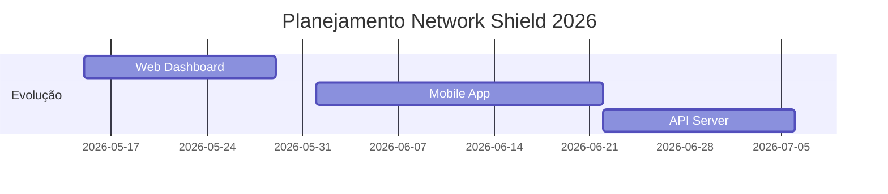

-----

# 🛡️ Network Shield

> **Monitoramento de rede em tempo real, leve e sem instalação.**
> Detecte anomalias, monitore tráfego real e proteja sua conexão com uma ferramenta *portable*.

-----

## ✨ Funcionalidades Principais

| Feature | Descrição | Status |
| :--- | :--- | :---: |
| **Tráfego Real** | Monitoramento em MB/s via `psutil`. | ✅ |
| **Detecção DDoS** | Alerta automático ao exceder 20MB/s contínuos. | ✅ |
| **Gráfico Vivo** | Visualização interativa com 100 pontos de histórico. | ✅ |
| **Alertas Visuais** | Notificação de queda de link e picos de anomalia. | ✅ |
| **Exportação** | Relatórios completos em formato `.json`. | ✅ |
| **Zero Instalação** | Executável portátil para Windows, Mac e Linux. | ✅ |

-----

## 🎮 Como Usar (30 Segundos)

O **Network Shield** foi feito para ser simples. Não precisa de configuração.


1.  **Baixe** o executável referente ao seu sistema.
2.  **Execute** o arquivo (não requer instalação).
3.  Clique em **"INICIAR MONITORAMENTO"**.
4.  Acompanhe o tráfego e as conexões TCP/UDP em tempo real.

-----

## 📊 Exemplo de Saída

Ao rodar o monitor, você terá acesso a dados precisos como:

> 🌐 **Tráfego:** 2.45 MB/s | 🔗 **Conexões:** 1.247 | 💻 **CPU:** 12.3%  
> 🚨 **ALERTA:** Possível DDoS detectado: 25.4 MB/s  
> 💾 **Log:** `NetworkShield_Report_2026.json` gerado com sucesso.

-----

## 🚀 Downloads

| Plataforma | Arquivo | Tamanho |
| :--- | :--- | :--- |
| **Windows** | `NetworkShield.exe` | 12MB |
| **macOS** | `NetworkShield-Mac.dmg` | 15MB |
| **Linux** | `NetworkShield.AppImage` | 14MB |

-----

## 👨‍💻 Para Desenvolvedores

Se preferir rodar via terminal ou buildar sua própria versão:

```bash
# Clone o repositório
git clone https://github.com/SEU-USUARIO/NetworkShield

# Instale as dependências
pip install -r requirements.txt

# Execute o script ou gere o executável
python build.py
```

### Lógica do Monitor (Core)

```python
# Cálculo de tráfego real em MB/s
io1 = psutil.net_io_counters()
time.sleep(1)
io2 = psutil.net_io_counters()
traffic = (io2.bytes_recv - io1.bytes_recv) / 1024 / 1024
```

-----

## 📈 Roadmap



-----

## 🤝 Contribuições

Sua ajuda é muito bem-vinda\!

1.  Faça um **Fork** do projeto.
2.  Crie uma **Branch** para sua feature (`git checkout -b feature/NovaFeature`).
3.  Dê um **Pull Request**.

⭐ **Deixe uma estrela se este projeto te ajudou\!**

-----

## 📄 Licença e Agradecimentos

  * **Licença:** MIT (Uso livre).
  * **Powered by:** `psutil` (dados), `PyInstaller` (compilação) e `Tkinter` (UI).

-----

\<div align="center"\>
Desenvolvido com ❤️ por \<b\>WhiteFox\</b\>
\</div\>
